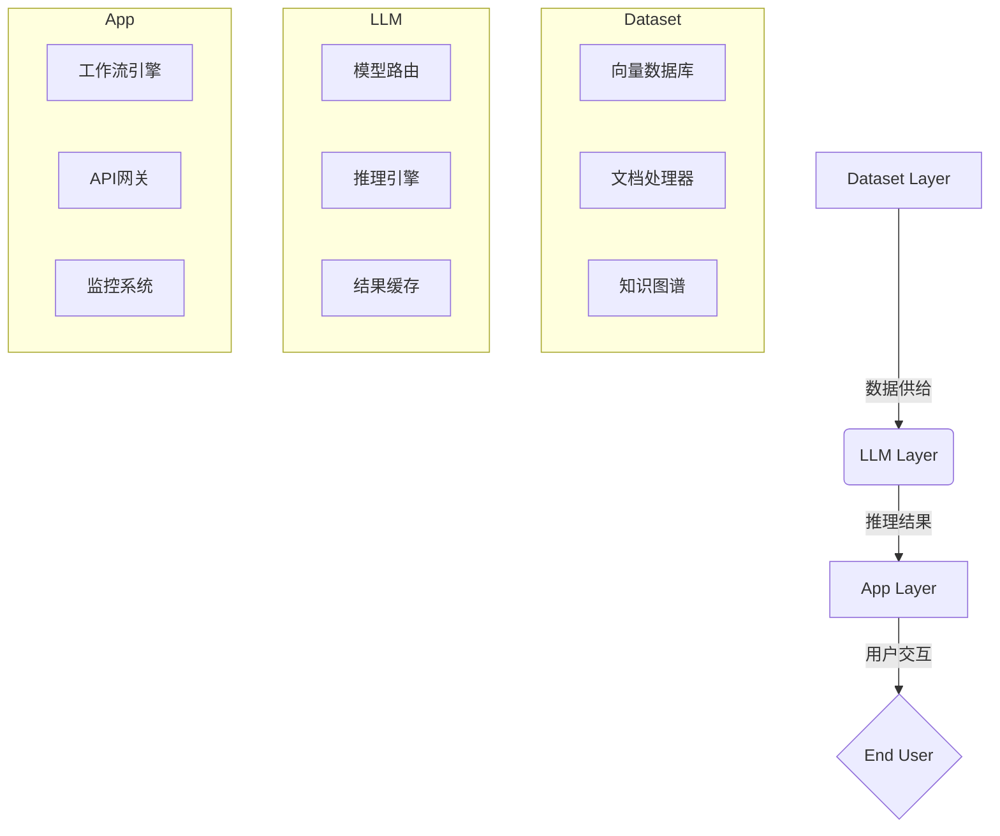
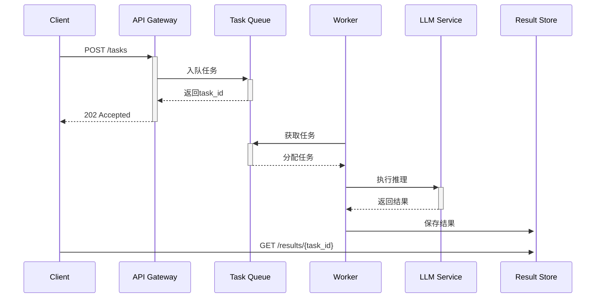

# Dify技术架构学习文档

---

## 一、核心架构概述
### 1. BaaS（Backend-as-a-Service）模式
- **定义**：以API为中心的后端服务架构，提供即插即用的AI能力
- **核心组件**：
  - API网关：统一入口管理
  - 微服务架构：功能模块解耦
  - 可扩展存储：MongoDB/PostgreSQL + Redis
  - 自动扩缩容：K8s集群支持
- **优势**：
  - 开发者聚焦业务逻辑
  - 基础设施自动运维
  - 弹性资源调度

### 2. Dataset-LLM-App 三层结构


---

## 二、Dataset-LLM-App 架构详解
### 1. Dataset Layer（数据集层）
- **核心功能**：
  - 知识库管理
  - 多格式文档处理（PDF/CSV/Markdown等）
  - 向量化存储（FAISS/Pinecone）
- **关键技术**：
  - 文档分块（Chunking）
  - 元数据标记
  - 语义索引构建
- **处理流程**：
  1. 原始文档 → 文本提取
  2. 文本分块（512-1024 tokens）
  3. 向量化嵌入（text-embedding-ada-002等）
  4. 存储到向量数据库

### 2. LLM Layer（大模型层）
- **核心组件**：
  - 模型路由器（Model Router）
  - 推理服务集群
  - 上下文管理器
- **功能特性**：
  - 多模型并行支持（GPT/Claude/文心一言等）
  - 动态负载均衡
  - 请求级缓存
  - 流式响应处理
- **典型工作流**：
  1. 接收App层请求
  2. 路由策略决策（模型选择）
  3. 构造prompt模板
  4. 调用目标模型API
  5. 后处理（格式转换/敏感词过滤）

### 3. App Layer（应用层）
- **核心模块**：
  - 工作流引擎（Airflow/Luigi）
  - 用户权限系统
  - 监控告警系统（Prometheus/Grafana）
- **关键能力**：
  - 可视化编排
  - 多租户隔离
  - 用量统计
  - 审计日志
- **接口规范**：
  - RESTful API
  - WebSocket实时通信
  - GraphQL数据查询

---

## 三、模型动态切换机制
### 1. OneAPI协议实现
```python
# 伪代码示例
class ModelRouter:
    def __init__(self, config):
        self.providers = load_providers(config['model_providers'])
        
    def route_request(self, request):
        strategy = self._select_routing_strategy(request)
        provider = strategy.select_provider()
        normalized_request = self._convert_to_oneapi_format(request)
        response = provider.execute(normalized_request)
        return self._standardize_response(response)
```

### 2. 核心实现机制
- **统一接口层**：
  - 输入标准化：统一prompt格式
  - 输出标准化：JSON Schema约束
- **路由策略**：
  - 权重轮询（Weighted Round Robin）
  - 最低延迟（Lowest Latency）
  - 人工指定（Manual Override）
- **动态配置管理**：
  - 热更新配置中心（Consul/ZooKeeper）
  - 模型健康检查（心跳检测）
  - 熔断降级机制（Hystrix模式）

### 3. 协议转换流程
1. 接收通用API请求
2. 解析模型类型参数
3. 选择对应适配器
4. 转换为目标平台格式（OpenAI格式/Anthropic格式等）
5. 添加平台特定参数（temperature/top_p等）

---

## 四、异步任务队列设计
### 1. 架构组成


### 2. 关键技术实现
- **消息中间件**：RabbitMQ/Celery
- **任务状态机**：
  - PENDING → PROCESSING → SUCCESS/FAILURE
- **重试机制**：
  - 指数退避重试（Exponential Backoff）
  - 死信队列处理
- **结果存储**：
  - Redis（短期存储）
  - S3/MinIO（长期归档）

---

## 五、最佳实践建议
1. **模型路由策略**：
   - 生产环境推荐组合策略：
     ```yaml
     routing_strategy:
       default: "weighted_round_robin"
       override:
         - when: 
             model_type: "code_generation"
           then: 
             strategy: "specific_provider"
             provider: "claude-2.1"
     ```

2. **性能优化技巧**：
   - 启用请求批处理（Batch Processing）
   - 使用GPUDirect RDMA加速
   - 实现缓存预热机制

3. **故障排查指南**：
   - 检查模型健康状态：`GET /v1/models/health`
   - 查看路由日志：`grep "ROUTING_DEBUG" dify.log`
   - 验证OneAPI转换：使用`dry_run`模式

---

## 六、扩展学习建议
1. 推荐调试工具：
   - Postman预置请求集
   - Dify CLI调试工具
2. 进阶学习路径：
   - 研究负载均衡算法实现
   - 分析gRPC流式处理源码
   - 实验自定义适配器开发
3. 性能测试方法：
   - 使用Locust进行压力测试
   - 绘制时延分布直方图
   - 分析GPU利用率指标

本学习文档需要结合Dify官方文档和实际代码进行验证，建议通过修改路由策略配置、添加自定义模型适配器等实践操作加深理解。