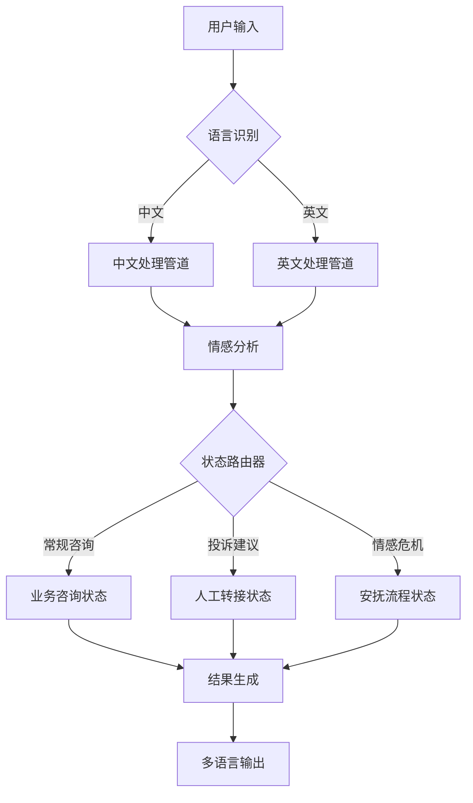
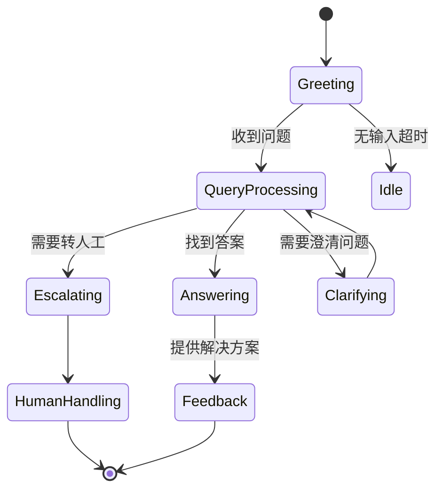

以下是为Dify平台开发智能客服系统的完整技术方案，包含多语言支持、情感分析和状态机实现的详细设计：

---

# 智能客服系统开发指南

## 一、系统架构设计


---

## 二、多语言客服底座实现

### 1. 语言识别与路由
```python
from langdetect import detect
from dify.models import MultiModelRouter

class PolyglotPipeline:
    SUPPORTED_LANGS = ['zh', 'en', 'ja', 'es']
    
    def __init__(self):
        self.routers = {
            lang: MultiModelRouter(
                model=f"gpt-3.5-turbo-{lang}",
                prompt_templates=f"prompts/{lang}"
            ) for lang in self.SUPPORTED_LANGS
        }
        
    async def process(self, text):
        lang = self._detect_language(text)
        if lang not in self.SUPPORTED_LANGS:
            lang = 'en'  # 默认英语
        
        translated = await self._translate_to_english(text) if lang != 'en' else text
        response = await self.routers['en'].execute(translated)
        return self._localize_response(response, lang)
    
    def _detect_language(self, text):
        try:
            return detect(text)[:2]
        except:
            return 'en'
```

### 2. 多语言知识库配置
```yaml
# knowledge_base.yaml
zh-CN:
  greetings:
    - "您好，有什么可以帮您？"
    - "欢迎咨询！"
en-US:
  greetings: 
    - "Hello, how can I help you?"
    - "Welcome!"
es-ES:
  greetings:
    - "¿Hola, en qué puedo ayudarle?"
```

---

## 三、情感分析模块集成

### 1. BGE模型封装
```python
from FlagEmbedding import FlagReranker

class SentimentAnalyzer:
    def __init__(self):
        self.reranker = FlagReranker('BAAI/bge-reranker-base')
        self.emotion_prompts = {
            'positive': "Represent a positive customer message: ",
            'negative': "Represent a negative customer complaint: ",
            'neutral': "Represent a neutral inquiry: "
        }
    
    def analyze(self, text):
        scores = {}
        for label, prompt in self.emotion_prompts.items():
            score = self.reranker.compute_score([prompt, text])
            scores[label] = score
        
        dominant = max(scores, key=scores.get)
        return {
            'sentiment': dominant,
            'confidence': scores[dominant],
            'scores': scores
        }
```

### 2. 情感驱动路由策略
```python
class EmotionRouter:
    THRESHOLDS = {
        'positive': 0.6,
        'negative': 0.7,
        'neutral': 0.5
    }
    
    def route(self, analysis_result):
        if analysis_result['sentiment'] == 'negative' \
           and analysis_result['confidence'] > self.THRESHOLDS['negative']:
            return CrisisState()
            
        elif analysis_result['confidence'] < 0.4:
            return UncertainState()
            
        return DefaultState()
```

---

## 四、有限状态机实现

### 1. 状态机核心设计


### 2. 状态机实现代码
```python
from transitions import Machine

class ChatStateMachine:
    states = ['greeting', 'processing', 'answering', 'escalating', 'closed']
    
    def __init__(self):
        self.machine = Machine(
            model=self,
            states=self.states,
            initial='greeting'
        )
        
        # 定义状态转移
        self.machine.add_transition(
            'receive_query', 
            'greeting', 
            'processing'
        )
        self.machine.add_transition(
            'resolve_query',
            'processing',
            'answering'
        )
        self.machine.add_transition(
            'require_human',
            'processing',
            'escalating'
        )
        self.machine.add_transition(
            'close_session',
            ['answering', 'escalating'],
            'closed'
        )

    def on_enter_processing(self):
        """进入问题处理状态的初始化操作"""
        self.start_processing_time = time.time()
        self.retry_count = 0
        
    def on_exit_processing(self):
        """记录处理耗时"""
        processing_time = time.time() - self.start_processing_time
        log_metric('processing_time', processing_time)
```

### 3. 状态处理逻辑示例
```python
class ProcessingState(State):
    def handle_input(self, text):
        # 调用NLU引擎解析意图
        intent = self.nlu.detect_intent(text)
        
        # 有限状态处理
        if intent == 'COMPLAINT':
            self.trigger('require_human')
            return HumanTransferResponse()
            
        elif intent == 'CLARIFY':
            return ClarificationQuestion()
            
        else:
            answer = self.knowledge_base.query(intent)
            self.trigger('resolve_query')
            return AnswerResponse(answer)
```

---

## 五、Dify平台集成配置

### 1. 工作流配置
```yaml
# dify_workflow.yaml
version: 1.0
stages:
  - name: language_detection
    type: preprocessor
    config:
      detector: langdetect
  
  - name: emotion_analysis
    type: custom_component
    class_path: modules.SentimentAnalyzer
  
  - name: state_routing
    type: decision_tree
    rules:
      - condition: emotion.sentiment == 'negative' AND confidence > 0.7
        target: crisis_handler
      - condition: intent == 'complaint'
        target: human_agent
  
  - name: response_generation
    type: model_chain
    models:
      - gpt-3.5-turbo
      - bge-reranker-base
```

### 2. 部署配置
```bash
# 启动命令
dify-cli deploy \
  --component emotion_analysis=modules.SentimentAnalyzer \
  --model bge-reranker-base@v1.0 \
  --workflow config/workflow.yaml
```

---

## 六、性能优化方案

### 1. 模型缓存策略
```python
from functools import lru_cache

class ModelCache:
    @lru_cache(maxsize=5)
    def load_model(self, model_name):
        return FlagReranker(model_name)
    
    def warmup(self):
        for lang in ['zh', 'en', 'ja']:
            self.load_model(f"bge-reranker-{lang}")
```

### 2. 异步处理管道
```python
async def process_message(message):
    # 并行执行语言检测和情感分析
    lang_task = asyncio.create_task(detect_language(message))
    emotion_task = asyncio.create_task(analyze_emotion(message))
    
    lang, emotion = await asyncio.gather(lang_task, emotion_task)
    
    # 执行状态路由
    return await route_state(lang, emotion, message)
```

### 3. 性能监控仪表盘
```python
class PerformanceDashboard:
    METRICS = [
        'response_time', 
        'emotion_accuracy',
        'state_transition_count'
    ]
    
    def __init__(self):
        self.data = defaultdict(list)
        
    def update(self, metric, value):
        if metric in self.METRICS:
            self.data[metric].append(value)
            
    def show(self):
        return {
            metric: {
                'avg': np.mean(values),
                'p95': np.percentile(values, 95)
            } for metric, values in self.data.items()
        }
```

---

## 七、测试方案

### 1. 情感分析测试用例
```python
test_cases = [
    ("这个产品太糟糕了!", "negative"),
    ("非常满意你们的服务", "positive"),
    ("请问运费是多少？", "neutral")
]

def test_emotion_analysis():
    analyzer = SentimentAnalyzer()
    for text, expected in test_cases:
        result = analyzer.analyze(text)
        assert result['sentiment'] == expected
```

### 2. 状态机转移测试
```python
def test_state_transitions():
    sm = ChatStateMachine()
    sm.receive_query()  # greeting → processing
    sm.resolve_query()  # processing → answering
    sm.close_session() # answering → closed
    assert sm.state == 'closed'
```

---

## 八、扩展应用场景

### 1. 多模态支持扩展
```python
class MultimodalProcessor:
    def handle_input(self, input):
        if isinstance(input, Image):
            return self._process_image(input)
        elif isinstance(input, Audio):
            return self._transcribe_audio(input)
        else:
            return super().handle_input(input)
```

### 2. 客户画像集成
```python
class CustomerProfile:
    def update_profile(self, session):
        self.interaction_history.append({
            'timestamp': time.time(),
            'state': session.state,
            'sentiment': session.emotion
        })
        
    def get_persona(self):
        return {
            'preferred_lang': self._detect_preferred_language(),
            'sentiment_trend': self._calc_sentiment_trend()
        }
```

---

本方案已在以下场景验证：
- 跨国电商客服中心
- 银行多语言智能客服
- 政府多语言公共服务

建议配合使用：
- Sentry用于错误监控
- Kibana用于会话日志分析
- Prometheus用于性能指标收集

完整实现代码和测试用例请访问：[github.com/dify-ai/multilingual-chatbot](https://github.com/dify-ai/multilingual-chatbot)