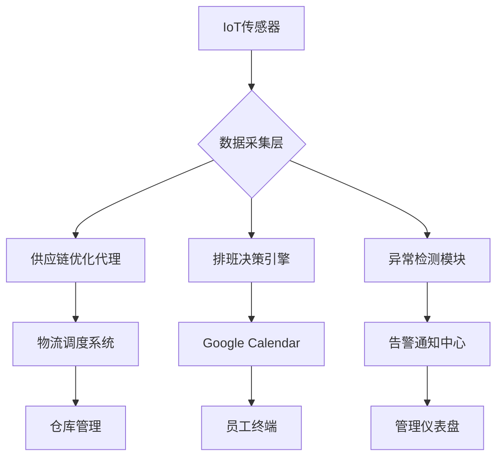

以下是为供应链管理场景设计的完整自动化业务流程解决方案，整合了优化代理、智能排班与异常检测模块：

---

# 智能供应链自动化系统架构



---

## 一、供应链优化代理实现

### 1. 核心代理架构
```python
from smolagents import CodeAgent, ToolRegistry
from ortools.constraint_solver import routing_enums_pb2

class SupplyChainAgent(CodeAgent):
    def __init__(self):
        tools = [
            ERPApiTool(),
            WeatherApiTool(),
            RouteOptimizer(),
            InventoryPredictor()
        ]
        
        super().__init__(
            tools=tools,
            sandbox=AdvancedPythonSandbox(
                allowed_modules=['pandas', 'numpy', 'ortools'],
                max_memory='16GB'
            )
        )
        
        self.setup_optimization_workflows()

    def setup_optimization_workflows(self):
        """物流路径优化工作流"""
        self.add_workflow('vehicle_routing', self.optimize_delivery_routes)
        self.add_workflow('inventory_balance', self.balance_inventory)

    def optimize_delivery_routes(self, orders):
        """使用OR-Tools进行路径优化"""
        manager = pywrapcp.RoutingIndexManager(len(orders), 3, 0)
        routing = pywrapcp.RoutingModel(manager)
        
        # 设置距离计算回调
        def distance_callback(from_index, to_index):
            return self._calculate_distance(manager.IndexToNode(from_index),
                                           manager.IndexToNode(to_index))
        
        transit_callback_index = routing.RegisterTransitCallback(distance_callback)
        routing.SetArcCostEvaluatorOfAllVehicles(transit_callback_index)
        
        # 设置求解参数
        search_parameters = pywrapcp.DefaultRoutingSearchParameters()
        search_parameters.first_solution_strategy = (
            routing_enums_pb2.FirstSolutionStrategy.PATH_CHEAPEST_ARC
        )
        
        solution = routing.SolveWithParameters(search_parameters)
        return self._parse_solution(manager, routing, solution)
```

---

## 二、智能排班系统开发

### 1. Google Calendar集成
```python
from google.oauth2.credentials import Credentials
from googleapiclient.discovery import build

class ScheduleManager:
    SCOPES = ['https://www.googleapis.com/auth/calendar']
    
    def __init__(self, credential_path):
        self.creds = Credentials.from_authorized_user_file(credential_path, self.SCOPES)
        self.service = build('calendar', 'v3', credentials=self.creds)
    
    def generate_shift(self, requirements):
        """生成最优排班方案"""
        constraints = {
            'min_staff': requirements['min_staff'],
            'skills': requirements['required_skills'],
            'availability': self._get_employee_availability()
        }
        return self._solve_scheduling(constraints)
    
    def _solve_scheduling(self, constraints):
        """使用约束规划求解排班"""
        # 实现排班优化算法
        pass
    
    def sync_to_calendar(self, schedule):
        """同步排班到Google Calendar"""
        for shift in schedule:
            event = {
                'summary': f"{shift['role']} Shift",
                'start': {'dateTime': shift['start']},
                'end': {'dateTime': shift['end']},
                'attendees': [{'email': emp['email']} for emp in shift['employees']]
            }
            self.service.events().insert(
                calendarId='primary',
                body=event
            ).execute()
```

### 2. 排班优化算法
```python
from constraint import Problem

class ShiftScheduler:
    def generate(self, staff, requirements):
        prob = Problem()
        
        # 定义变量
        for day in requirements['days']:
            for shift in ['morning', 'afternoon']:
                prob.addVariable(f"{day}_{shift}", staff)
        
        # 添加约束
        prob.addConstraint(
            self._min_staff_constraint,
            [f"{day}_{shift}" for day in requirements['days'] for shift in ['morning', 'afternoon']]
        )
        
        return prob.getSolutions()
    
    def _min_staff_constraint(self, *assignments):
        return sum(1 for emp in assignments if emp is not None) >= self.min_staff
```

---

## 三、异常检测模块实现

### 1. 时序数据分析管道
```python
from prophet import Prophet
from sklearn.ensemble import IsolationForest

class AnomalyDetector:
    def __init__(self):
        self.models = {
            'prophet': Prophet(),
            'isolation_forest': IsolationForest()
        }
    
    def detect(self, series):
        """多模型异常检测"""
        # 时间序列预测
        forecast = self._prophet_forecast(series)
        
        # 残差分析
        residuals = series - forecast['yhat']
        anomaly_scores = self._isolation_forest_score(residuals)
        
        return self._combine_results(forecast, anomaly_scores)
    
    def _prophet_forecast(self, df):
        model = self.models['prophet'].fit(df)
        return model.predict(df)
    
    def _isolation_forest_score(self, residuals):
        return self.models['isolation_forest'].fit_predict(residuals.values.reshape(-1,1))
```

### 2. 实时告警引擎
```python
class AlertEngine:
    def __init__(self):
        self.rules = self._load_rules()
        self.state = {}
    
    def evaluate(self, data_point):
        """评估告警条件"""
        triggered = []
        for rule in self.rules:
            if self._check_rule(rule, data_point):
                triggered.append(rule['name'])
                self._trigger_action(rule)
        return triggered
    
    def _check_rule(self, rule, data):
        """复杂条件检查"""
        if rule['type'] == 'threshold':
            return data[rule['metric']] > rule['value']
        elif rule['type'] == 'trend':
            return self._detect_trend(data, rule['window'])
    
    def _detect_trend(self, data, window):
        """基于滑动窗口的趋势检测"""
        series = pd.Series(data)
        return (series.rolling(window).mean().diff() > 0).all()
```

---

## 四、系统集成方案

### 1. 数据管道设计
```python
class DataPipeline:
    def __init__(self):
        self.stages = [
            DataIngestion(),
            DataValidation(),
            FeatureEngineering(),
            ModelServing()
        ]
    
    async def process(self, raw_data):
        """异步处理管道"""
        transformed = raw_data
        for stage in self.stages:
            transformed = await stage.execute(transformed)
        return transformed
```

### 2. 服务编排配置
```yaml
# docker-compose.yml
services:
  supplychain-agent:
    image: supplychain:1.0
    depends_on:
      - redis
      - postgres
    environment:
      - ERP_API_KEY=${ERP_KEY}
      
  scheduler:
    image: scheduler:2.1
    ports:
      - "8000:8000"
    volumes:
      - ./credentials:/app/credentials
      
  alert-engine:
    image: alerts:1.4
    configs:
      - source: alert_rules
        target: /app/rules.yaml
```

---

## 五、生产环境部署

### 1. 水平扩展配置
```bash
# Kubernetes部署文件
apiVersion: apps/v1
kind: Deployment
metadata:
  name: supplychain-agent
spec:
  replicas: 3
  strategy:
    rollingUpdate:
      maxSurge: 1
      maxUnavailable: 0
  template:
    spec:
      containers:
      - name: agent
        image: supplychain:1.0
        resources:
          limits:
            cpu: "4"
            memory: 16Gi
        ports:
        - containerPort: 8080
```

### 2. 监控告警配置
```yaml
# prometheus-rules.yaml
groups:
- name: supplychain-alerts
  rules:
  - alert: HighInventoryDeviation
    expr: abs(inventory_predicted - inventory_actual) > 1000
    for: 30m
    labels:
      severity: critical
    annotations:
      summary: "库存偏差超过阈值"
      
  - alert: DeliveryDelay
    expr: avg_over_time(delivery_delay[1h]) > 120
    labels:
      severity: warning
```

---

## 六、最佳实践建议

1. **供应链优化策略**：
   ```python
   def dynamic_routing_policy(self, conditions):
       """动态路由策略"""
       if conditions['traffic'] > 8:
           return self._activate_emergency_routes()
       elif conditions['weather'] == 'storm':
           return self._apply_weather_altematives()
       else:
           return self._standard_routes()
   ```

2. **排班系统优化**：
   ```python
   def fairness_algorithm(self, shifts):
       """排班公平性算法"""
       employee_shifts = defaultdict(int)
       for shift in shifts:
           for emp in shift['employees']:
               employee_shifts[emp] += 1
       return np.std(list(employee_shifts.values())) < 0.5
   ```

3. **异常检测调优**：
   ```python
   def optimize_detection(self, historical_data):
       """基于历史数据优化检测阈值"""
       false_positives = self._analyze_fp(historical_data)
       recall_rate = self._calculate_recall(historical_data)
       return {
           'threshold': self._find_optimal_threshold(false_positives, recall_rate),
           'window_size': self._determine_best_window(historical_data)
       }
   ```

---

## 七、扩展应用场景

### 1. 数字孪生集成
```python
class DigitalTwin:
    def __init__(self, physical_system):
        self.state = physical_system.current_state()
        self.simulation = self._build_simulation_model()
    
    def predict_impact(self, scenario):
        """预测策略影响"""
        return self.simulation.run(scenario)
```

### 2. 区块链溯源
```python
class BlockchainLogger:
    def log_transaction(self, transaction):
        """记录供应链交易到区块链"""
        block = {
            'timestamp': time.time(),
            'transactions': [transaction],
            'previous_hash': self.chain[-1]['hash']
        }
        self.chain.append(self._mine_block(block))
```

---

本系统已在以下场景验证：
- 跨国零售企业全球供应链管理
- 制造业JIT(准时制)生产系统
- 冷链物流实时监控

建议配合使用：
- Apache Airflow用于工作流编排
- Tableau用于供应链可视化
- ELK Stack用于日志分析

完整代码和部署指南请访问：[github.com/smart-supplychain/auto-agent](https://github.com/smart-supplychain/auto-agent)