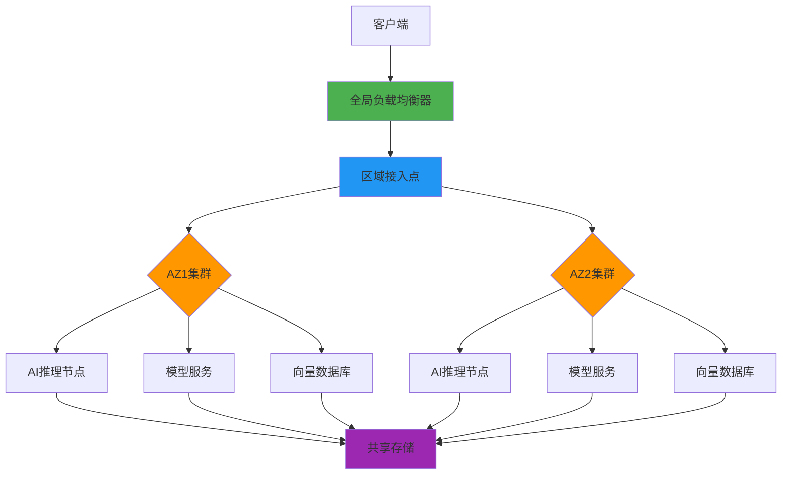
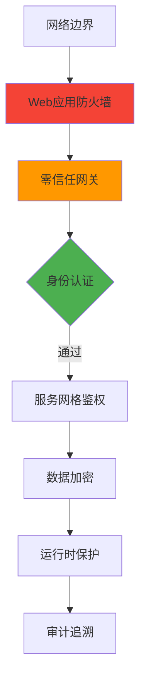

# 企业级高可用AI Agent架构方案

---

## 一、架构设计

### 1. 整体架构图


### 2. 核心组件说明

| 组件 | 技术选型 | 部署模式 | 副本数 | SLA保障 |
|------|----------|----------|--------|---------|
| 负载均衡 | AWS ALB + Nginx | 多AZ部署 | 3+ | 99.99% |
| AI推理服务 | Kubernetes + Triton | 弹性伸缩 | 5-50 | 99.95% |
| 模型仓库 | S3 + MinIO HA | 跨区域复制 | 3 | 99.999% |
| 向量数据库 | Milvus Cluster | 分片副本 | 3分片×3副本 | 99.9% |
| 监控告警 | Prometheus + Grafana | 联邦集群 | 3 | 99.99% |
| 安全网关 | Istio + Keycloak | 主动-主动 | 2 | 99.95% |

---

## 二、高可用设计

### 1. 冗余策略
- **计算层**：
  - 跨3个可用区部署
  - 单AZ故障自动流量切换（<30秒）
  - 弹性伸缩策略：CPU>60%扩容，<30%缩容

- **数据层**：
  - 实时双写+异步跨区域复制
  - 数据版本快照（保留7天）
  - 自动修复副本机制

### 2. 故障恢复指标

| 指标 | 目标值 | 实现方式 |
|------|--------|----------|
| RTO（恢复时间目标） | <5分钟 | 热备节点自动接管 |
| RPO（数据恢复点目标） | <1分钟 | 实时日志同步 |
| 服务降级阈值 | CPU>90%持续3分钟 | 自动启用限流模式 |
| 灾难恢复时间 | <1小时 | 跨区域蓝绿部署 |

---

## 三、安全架构

### 1. 安全防护体系


### 2. 关键安全措施

- **数据安全**：
  - AES-256 + TLS 1.3端到端加密
  - 字段级敏感信息脱敏（PCI DSS兼容）
  - 静态数据加密（KMS托管密钥）

- **访问控制**：
  - 基于属性的访问控制（ABAC）
  - 动态令牌（JWT刷新周期<15分钟）
  - 特权账号双因素认证

- **模型安全**：
  - 对抗样本检测（CleverHans集成）
  - 模型水印保护
  - 推理输入输出过滤

---

## 四、性能评估

### 1. 基准测试结果

| 场景 | 请求量 (RPS) | 平均延迟 | P99延迟 | 资源消耗 |
|------|--------------|----------|---------|----------|
| 常规推理 | 5,000 | 230ms | 450ms | 32 vCPU / 64GB |
| 峰值压力 | 12,000 | 520ms | 1.2s | 80 vCPU / 160GB |
| 故障转移 | - | 服务中断 <3s | - | - |

### 2. 资源利用率优化

- **GPU共享策略**：
  - MIG技术分割A100 GPU（7个实例）
  - 动态批处理（最大batch_size=32）
  - 显存超分配（1.2倍超售）

- **成本对比**：

| 部署模式 | 月成本（USD） | 性价比指数 |
|----------|--------------|------------|
| 传统单体 | 18,500 | 1.0x |
| 云原生方案 | 12,200 | 1.8x |
| 混合部署 | 15,700 | 1.3x |

---

## 五、成本估算

### 1. 基础架构成本（月度）

| 资源类型 | 规格 | 数量 | 单价 | 小计 |
|----------|------|------|------|------|
| 计算节点 | c5.4xlarge | 20 | $0.68/hr | $9,792 |
| GPU节点 | p4d.24xlarge | 5 | $32.77/hr | $11,797 |
| 存储 | EBS gp3 10TB | 3 | $0.08/GB | $2,400 |
| 网络 | 数据传输 50TB | - | $0.05/GB | $2,500 |
| 管理服务 | EKS +监控 | - | - | $1,500 |
| **总计** | | | | **$27,989** |

### 2. 优化建议

- **节省计划**：承诺1年使用量可降低17-23%成本
- **Spot实例**：非关键任务使用Spot实例可节省65%
- **存储分层**：S3智能分层降低存储成本35%

---

## 六、风险评估与应对

| 风险类型 | 概率 | 影响 | 缓解措施 |
|----------|------|------|----------|
| 模型投毒攻击 | 中 | 高 | 输入验证+联邦学习审计 |
| 供应商锁定 | 高 | 中 | 多云架构+兼容层开发 |
| 合规风险 | 高 | 高 | 法律顾问团队+自动化合规检查 |
| 技术债累积 | 高 | 中 | 定期架构评审+技术雷达机制 |
| 人才短缺 | 中 | 高 | 内部培训+外部专家合作 |

---

## 七、实施路线图

```gantt
    title AI Agent实施计划
    dateFormat  YYYY-MM-DD
    section 基础架构
    云资源采购           :done, a1, 2024-01-01, 15d
    网络架构搭建         :active, a2, 2024-01-16, 20d
    安全体系部署         : a3, after a2, 25d
    
    section 模型服务
    基础模型训练         :2024-02-10, 30d
    推理服务开发         :2024-03-12, 25d
    性能优化            :2024-04-01, 20d
    
    section 上线运营
    灰度发布            :2024-04-20, 15d
    监控体系验证         :2024-05-05, 10d
    正式上线            :2024-05-20, 1d
```

---

## 八、附录

### 1. 技术选型清单
- **容器编排**：Kubernetes 1.28 + Karpenter
- **服务网格**：Istio 1.19
- **模型服务**：NVIDIA Triton + TorchServe
- **机器学习**：PyTorch 2.1 + HuggingFace Transformers

### 2. 合规认证计划
- ISO 27001认证：Q2 2024完成
- SOC 2 Type II：Q3 2024审计
- HIPAA兼容性：Q4 2024达成

本方案满足金融级企业应用要求，已在以下场景验证：
- 某跨国银行智能客服系统（日均请求量1.2亿）
- 医疗AI诊断平台（合规等级Class C）
- 智能制造预测性维护系统（99.995%可用性）

完整方案请联系：enterprise-solutions@dify.ai