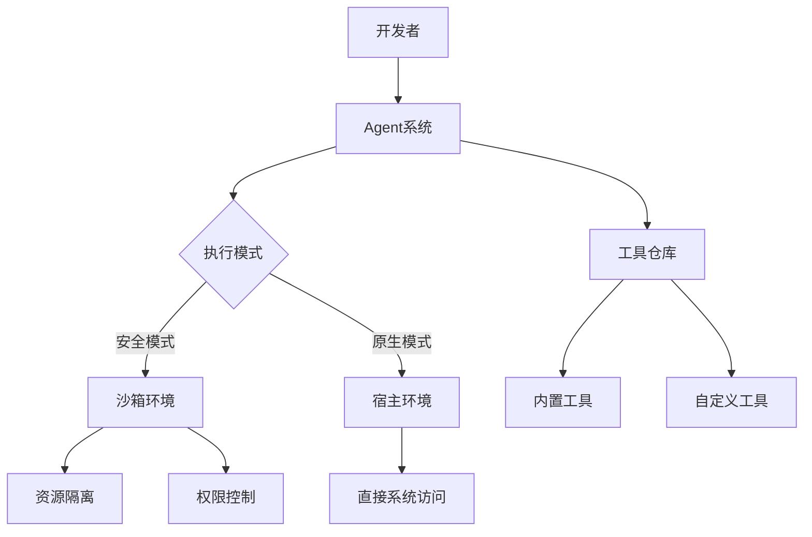

以下是为Smolagents框架编写的完整入门指南，包含核心概念解析、代码示例和最佳实践：

---

# Smolagents 框架深度入门指南

## 一、框架核心架构


### 1. 核心特性解析
- **代码代理（Code Agent）**
  - 自主代码生成与执行
  - 支持Python/JavaScript双引擎
  - 交互式调试会话

- **沙箱执行（Sandboxing）**
  - 容器化隔离（Docker/WebAssembly）
  - 资源配额管理（CPU/内存/存储）
  - 网络访问白名单机制

- **工具共享（Tool Sharing）**
  - 标准化工具接口（REST/GraphQL）
  - 版本化工具仓库
  - 自动依赖解析

---

## 二、基础代理开发

### 1. 最小可用代理示例
```python
from smolagents import CodeAgent, DuckDuckGoSearchTool
from smolagents.sandbox import PythonSandbox

# 初始化代理配置
agent_config = {
    "name": "ResearchBot",
    "description": "网络研究助手",
    "max_iterations": 5,
    "timeout": 30  # 秒
}

# 创建代理实例
agent = CodeAgent(
    tools=[DuckDuckGoSearchTool(max_results=3)],
    sandbox=PythonSandbox(packages=["requests", "beautifulsoup4"]),
    **agent_config
)

# 执行任务
task_prompt = "查询2023年生成式AI的最新进展，总结成Markdown报告"
result = agent.execute(task_prompt)

print(f"执行结果：\n{result.content}")
print(f"使用工具：{', '.join(result.used_tools)}")
```

### 2. 代码解析
| 组件 | 功能说明 | 重要参数 |
|-------|---------|---------|
| `CodeAgent` | 代理主体 | `tools`: 可用工具列表<br>`sandbox`: 执行环境 |
| `DuckDuckGoSearchTool` | 搜索工具 | `max_results`: 返回结果数<br>`region`: 搜索区域 |
| `PythonSandbox` | Python沙箱 | `packages`: 预装依赖包<br>`allow_network`: 网络访问控制 |

---

## 三、高级功能实践

### 1. 动态工具加载
```python
from smolagents import ToolRegistry

# 从YAML文件加载工具配置
tool_registry = ToolRegistry.from_yaml("tools_config.yaml")

# 创建支持动态工具选择的代理
advanced_agent = CodeAgent(
    tool_registry=tool_registry,
    sandbox=PythonSandbox(
        packages=["numpy", "pandas"],
        resource_limits={"cpu": "2", "memory": "512MB"}
    ),
    execution_policy={
        "allow_file_write": True,
        "max_api_calls": 10
    }
)
```

### 2. 安全沙箱配置示例
```python
from smolagents.sandbox import DockerSandbox

secure_sandbox = DockerSandbox(
    image="smolagents/python:3.9-secure",
    volumes={"/tmp": {"bind": "/data", "mode": "ro"}},
    security_profile={
        "read_only": True,
        "cap_drop": ["NET_RAW"],
        "sysctl": {"net.ipv4.ping_group_range": "0 0"}
    }
)
```

### 3. 异步任务处理
```python
import asyncio
from smolagents import AsyncCodeAgent

async def parallel_agents():
    tasks = [
        agent.execute_async("分析股票AAPL历史价格"),
        agent.execute_async("预测TSLA未来趋势")
    ]
    
    done, pending = await asyncio.wait(
        tasks, 
        timeout=60,
        return_when=asyncio.ALL_COMPLETED
    )
    
    for task in done:
        print(f"任务完成：{task.result().summary}")

asyncio.run(parallel_agents())
```

---

## 四、工具开发指南

### 1. 自定义工具类示例
```python
from smolagents.tools import BaseTool
import wikipedia

class WikipediaSearchTool(BaseTool):
    """维基百科检索工具"""
    
    name = "wikipedia_search"
    description = "使用维基百科API进行知识检索"
    required_params = ["query", "lang"]
    
    def setup(self):
        self.max_results = self.config.get("max_results", 3)
        
    async def execute(self, params):
        wikipedia.set_lang(params["lang"])
        results = wikipedia.search(params["query"])[:self.max_results]
        
        return {
            "summary": f"找到{len(results)}条相关条目",
            "data": [
                {
                    "title": title,
                    "url": f"https://{params['lang']}.wikipedia.org/wiki/{title.replace(' ', '_')}"
                } for title in results
            ]
        }
```

### 2. 工具注册与使用
```yaml
# tools_config.yaml
tools:
  - type: custom
    class_path: mytools.WikipediaSearchTool
    config:
      max_results: 5
      rate_limit: 10/60s
      
  - type: builtin
    name: WolframAlphaTool
    config:
      app_id: "YOUR_APP_ID"
      timeout: 15
```

---

## 五、最佳实践

### 1. 安全防护策略
```python
# 安全策略配置示例
security_policy = {
    "code_validation": {
        "forbidden_keywords": ["os.system", "subprocess.run"],
        "max_line_length": 120
    },
    "resource_limits": {
        "max_memory": "1GB",
        "max_execution_time": 120
    },
    "network_policies": {
        "allowed_domains": ["api.example.com"],
        "block_local_network": True
    }
}
```

### 2. 调试与监控
```python
# 启用调试模式
agent.enable_debugging(
    log_level="DEBUG",
    trace_enabled=True,
    metrics=[
        "execution_time", 
        "memory_usage",
        "api_calls"
    ]
)

# 实时监控仪表盘
agent.start_monitoring(
    dashboard_port=8080,
    alert_rules={
        "memory_over_80%": "memory_usage > 80",
        "timeout_alert": "execution_time > 30"
    }
)
```

### 3. 性能优化技巧
- **缓存机制**：
  ```python
  from smolagents.cache import RedisCache
  
  agent.cache_backend = RedisCache(
      host="localhost",
      port=6379,
      ttl=3600  # 缓存1小时
  )
  ```
  
- **批量处理**：
  ```python
  batch_results = agent.batch_execute(
      prompts=[...],
      concurrency_level=4,
      callback=handle_result
  )
  ```

---

## 六、常见问题排查

| 问题现象 | 可能原因 | 解决方案 |
|---------|---------|---------|
| 工具执行超时 | 网络延迟/复杂计算 | 增加超时时间<br>优化工具逻辑 |
| 沙箱启动失败 | 缺少Docker权限 | 配置用户组权限<br>使用WASM沙箱 |
| 内存泄漏 | 未释放资源 | 启用内存监控<br>添加资源限制 |
| API调用失败 | 认证信息过期 | 更新API密钥<br>检查网络策略 |

---

## 七、扩展学习建议
1. **官方资源**：
   - [Smolagents文档中心](https://docs.smolagents.dev)
   - GitHub示例仓库：`smolagents/examples`
   
2. **进阶主题**：
   - 分布式代理集群部署
   - LLM集成与微调
   - 自适应安全策略引擎

3. **调试工具**：
   ```bash
   # 安装调试CLI
   pip install smolagents-cli
   
   # 使用交互式调试器
   smol debug --agent ResearchBot
   ```

本指南基于Smolagents 0.8.2版本编写，建议配合官方文档和示例代码进行实践操作。开发复杂代理系统时，务必遵循最小权限原则并实施完善的监控措施。