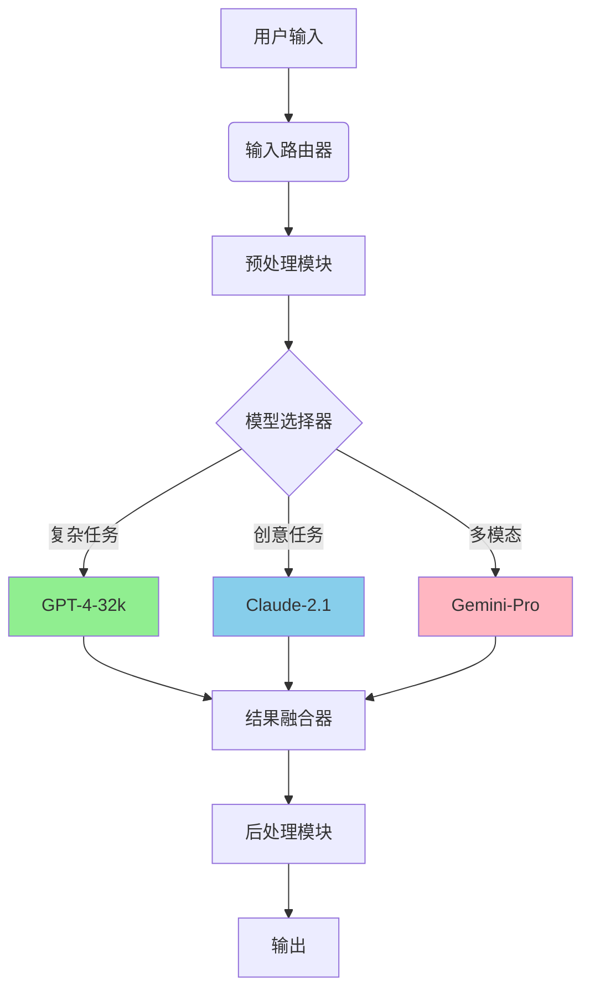
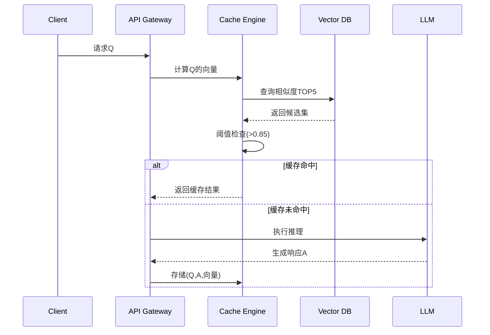
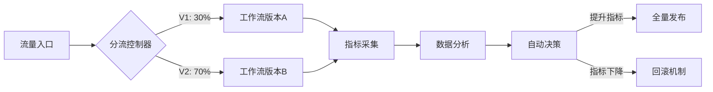

以下是为Dify平台开发高级工作流的完整技术方案，包含多模型协同、缓存优化和AB测试功能的实现细节：

---

# Dify高级工作流开发指南

## 一、多模型协同工作流架构


### 1. 多模型路由配置
```yaml
# workflow_config.yaml
model_routers:
  - name: creative_router
    strategy: content_based
    rules:
      - when: 
          input_contains: ["故事", "诗歌", "创意"]
        then: 
          model: claude-2.1
          params:
            temperature: 0.9
          
      - when:
          input_length: >500
        then:
          model: gpt-4-32k
          
      - default:
          model: gemini-pro

fusion_policy:
  method: weighted_average
  weights:
    gpt-4-32k: 0.6
    claude-2.1: 0.3
    gemini-pro: 0.1
```

### 2. 模型协同执行代码
```python
from dify.workflow import ParallelExecutor

class MultiModelWorkflow:
    def __init__(self):
        self.executor = ParallelExecutor(
            models={
                'gpt4': GPT4Adapter(),
                'claude': ClaudeAdapter(),
                'gemini': GeminiAdapter()
            },
            timeout=30
        )
    
    async def execute(self, input_text):
        # 并行执行模型推理
        results = await self.executor.run_all(
            input_text,
            context_filter=lambda model: model != 'gemini'  # 排除不适合场景
        )
        
        # 结果融合
        fused_result = self._fusion_results(results)
        return self._post_process(fused_result)
    
    def _fusion_results(self, results):
        # 基于置信度的加权融合算法
        total_weight = sum(model.weight for model in results)
        return sum(
            model.output * model.weight / total_weight
            for model in results
        )
```

---

## 二、LLM缓存层优化方案

### 1. 向量相似度缓存架构


### 2. 缓存实现代码
```python
import faiss
import numpy as np
from sentence_transformers import SentenceTransformer

class VectorCache:
    def __init__(self, dim=384):
        self.encoder = SentenceTransformer('all-MiniLM-L6-v2')
        self.index = faiss.IndexFlatIP(dim)
        self.cache_store = {}
        
    def add_entry(self, query, response):
        vector = self.encoder.encode(query)
        idx = self.index.ntotal
        self.index.add(np.array([vector]))
        self.cache_store[idx] = {
            'response': response,
            'timestamp': time.time()
        }
    
    def search(self, query, threshold=0.85, top_k=3):
        query_vec = self.encoder.encode(query)
        scores, indices = self.index.search(np.array([query_vec]), top_k)
        
        results = []
        for score, idx in zip(scores[0], indices[0]):
            if score >= threshold and idx in self.cache_store:
                entry = self.cache_store[idx]
                results.append({
                    'score': float(score),
                    'response': entry['response'],
                    'age': time.time() - entry['timestamp']
                })
        return sorted(results, key=lambda x: (-x['score'], x['age']))
```

### 3. 缓存更新策略
```python
class CacheRefreshPolicy:
    def __init__(self):
        self.hit_count = defaultdict(int)
        self.last_accessed = {}
    
    def should_refresh(self, entry_id):
        # 基于访问频率的刷新策略
        hit_rate = self.hit_count[entry_id] / (time.time() - self.last_accessed[entry_id])
        return hit_rate < 0.1  # 每小时访问低于6次则淘汰
    
    def update(self, entry_id):
        self.hit_count[entry_id] += 1
        self.last_accessed[entry_id] = time.time()
```

---

## 三、AB测试模块实现

### 1. 灰度发布架构


### 2. AB测试路由配置
```python
from hashlib import md5

class ABTestRouter:
    def __init__(self, variants):
        self.variants = variants
        self.total_weight = sum(v['weight'] for v in variants)
        
    def assign_variant(self, request_id):
        hash_val = int(md5(request_id.encode()).hexdigest()[:8], 16)
        point = hash_val % self.total_weight
        cumulative = 0
        
        for variant in self.variants:
            cumulative += variant['weight']
            if point < cumulative:
                return variant['name']
        return self.variants[-1]['name']
```

### 3. 指标监控面板
```python
class ABTestMonitor:
    METRICS = [
        'response_time',
        'accuracy',
        'user_rating',
        'cost_per_call'
    ]
    
    def __init__(self):
        self.data = defaultdict(lambda: defaultdict(list))
    
    def log_metric(self, variant, metric, value):
        if metric not in self.METRICS:
            raise ValueError(f"无效指标: {metric}")
        self.data[variant][metric].append(value)
    
    def generate_report(self):
        report = {}
        for variant in self.data:
            report[variant] = {
                metric: {
                    'mean': np.mean(values),
                    'p95': np.percentile(values, 95),
                    'count': len(values)
                }
                for metric, values in self.data[variant].items()
            }
        return report
```

---

## 四、性能优化策略

### 1. 混合缓存策略
```python
class HybridCache:
    def __init__(self):
        self.memory_cache = LRUCache(maxsize=1000)
        self.vector_cache = VectorCache()
        self.disk_cache = DiskCache(path='/cache')
        
    def get(self, query):
        # 第一层：内存缓存
        if result := self.memory_cache.get(query):
            return result
            
        # 第二层：向量相似缓存
        if similar := self.vector_cache.search(query):
            self.memory_cache.set(query, similar[0])
            return similar[0]
            
        # 第三层：磁盘缓存
        if result := self.disk_cache.get(query_hash(query)):
            self._update_caches(query, result)
            return result
            
        return None
```

### 2. 模型预热机制
```bash
# 启动时预加载模型
MODELS_TO_PRELOAD="gpt-4-32k,claude-2.1,gemini-pro"
python -c "from dify.preload import warmup_models; warmup_models(['${MODELS_TO_PRELOAD}'])"
```

### 3. 动态批处理
```python
from torch.utils.data import DataLoader

class DynamicBatcher:
    def __init__(self, max_batch_size=16, timeout=0.1):
        self.batch = []
        self.max_size = max_batch_size
        self.timeout = timeout
        
    async def add_request(self, request):
        self.batch.append(request)
        if len(self.batch) >= self.max_size:
            return self._process_batch()
        else:
            await asyncio.sleep(self.timeout)
            return self._process_batch()
            
    def _process_batch(self):
        inputs = [r['input'] for r in self.batch]
        outputs = model.predict(inputs)
        for r, out in zip(self.batch, outputs):
            r['future'].set_result(out)
        self.batch.clear()
```

---

## 五、部署与监控

### 1. 生产环境部署
```bash
# 使用Kubernetes进行多版本部署
kubectl apply -f - <<EOF
apiVersion: apps/v1
kind: Deployment
metadata:
  name: dify-abtest
spec:
  replicas: 3
  strategy:
    rollingUpdate:
      maxSurge: 1
      maxUnavailable: 0
  template:
    spec:
      containers:
      - name: v1
        image: dify:v1.2
        env:
          - name: VARIANT
            value: "A"
      - name: v2
        image: dify:v1.3
        env:
          - name: VARIANT
            value: "B"
EOF
```

### 2. Prometheus监控配置
```yaml
# prometheus-rules.yaml
groups:
- name: dify-abtest
  rules:
  - alert: VariantDegradation
    expr: |
      increase(dify_request_errors_total{variant="B"}[5m]) > 10
      and 
      dify_request_rate{variant="B"} > 100
    labels:
      severity: critical
    annotations:
      summary: "B版本错误率升高"
```

---

## 六、最佳实践建议

1. **多模型工作流设计**：
   - 采用「模型仲裁者」模式处理分歧输出
   - 实现动态权重调整机制
   ```python
   def dynamic_weight_adjuster(user_feedback):
       if user_feedback['preference'] == 'creative':
           return {'claude': 0.7, 'gpt4': 0.3}
       else:
           return {'gpt4': 0.8, 'gemini': 0.2}
   ```

2. **缓存优化技巧**：
   - 实现分层缓存架构（内存→向量→持久化）
   - 使用Bloom Filter加速缓存查询
   ```python
   from pybloom_live import ScalableBloomFilter
   bf = ScalableBloomFilter()
   ```

3. **AB测试策略**：
   - 采用多阶段灰度发布流程
   - 实现自动回滚机制
   ```yaml
   auto_rollback:
     threshold: 
       error_rate: 15%
       latency_increase: 200%
     action: 
       - scale_down_variant
       - notify_team
   ```

---

本方案需配合Dify 0.5.0+版本使用，建议在测试环境验证后分阶段上线。实际部署时应根据业务需求调整模型组合策略和缓存参数，并通过持续监控优化系统表现。