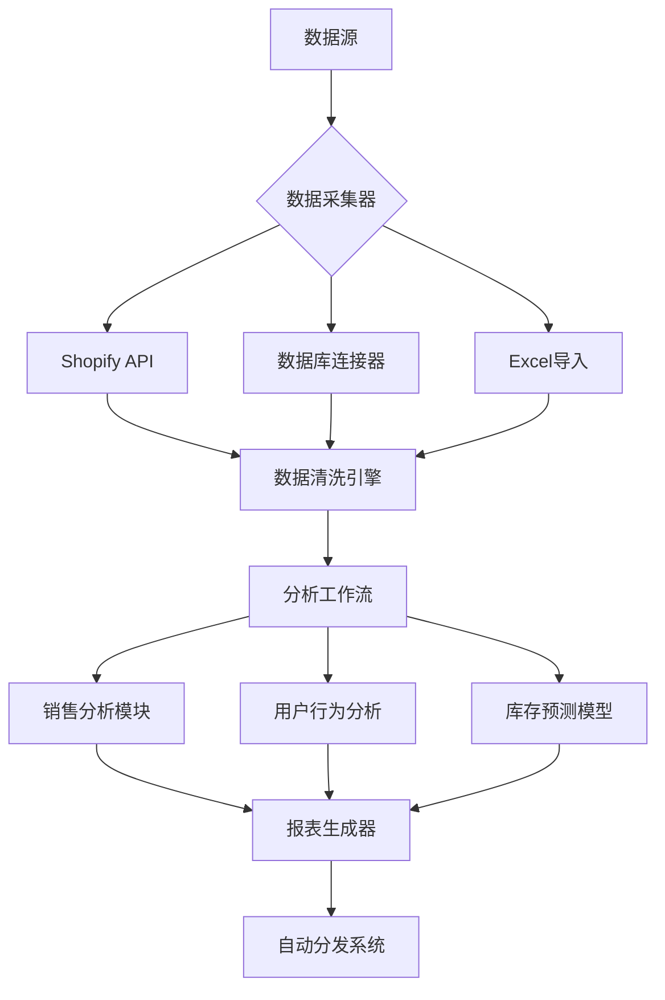
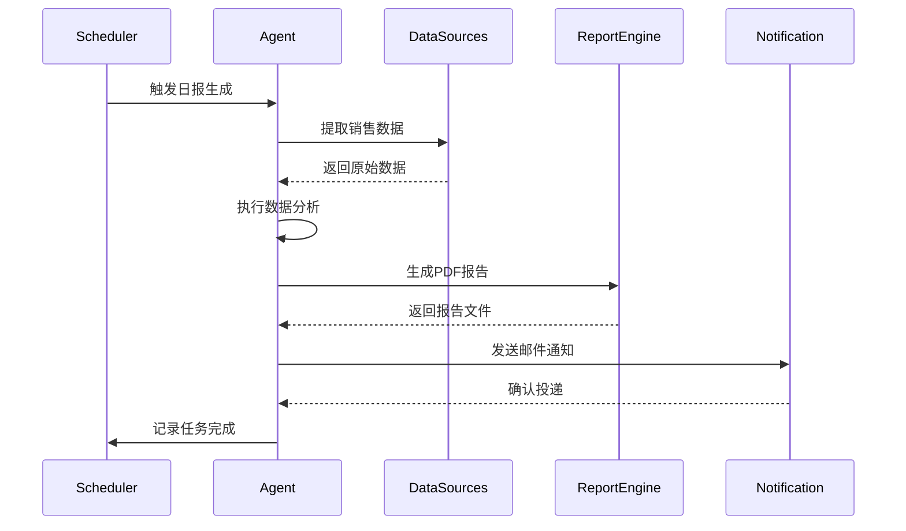

以下是为Smolagents框架开发的完整电商数据分析代理系统实现方案，包含高级数据分析功能和自动化报表生成能力：

---

# 电商智能分析代理系统架构



---

## 一、核心代理实现

### 1. 增强型电商分析代理类
```python
from smolagents import CodeAgent, ToolRegistry
from smolagents.sandbox import SecurePythonSandbox
import pandas as pd
import numpy as np

class EcommerceAnalyticsAgent(CodeAgent):
    def __init__(self, config):
        tools = [
            ShopifyAPITool(config['shopify']),
            BigQueryConnector(config['bigquery']),
            EmailNotifier(config['smtp']),
            ReportGenerator(),
            AnomalyDetector()
        ]
        
        super().__init__(
            tools=tools,
            sandbox=SecurePythonSandbox(
                allowed_modules=['pandas', 'numpy', 'sklearn'],
                max_memory='8GB'
            ),
            security_profile=config.get('security', {})
        )
        
        self.register_analysis_workflows()
        self._init_scheduled_tasks()

    def register_analysis_workflows(self):
        """注册预定义分析工作流"""
        self.add_workflow('daily_sales', self._daily_sales_analysis)
        self.add_workflow('customer_segmentation', self._segment_customers)
        self.add_workflow('inventory_forecast', self._forecast_inventory)

    def _init_scheduled_tasks(self):
        """初始化定时任务"""
        self.scheduler = BackgroundScheduler()
        self.scheduler.add_job(
            self.execute_workflow,
            'cron',
            hour=2,
            args=['daily_sales']
        )
        self.scheduler.start()
```

---

## 二、数据分析工具链实现

### 1. 增强型Shopify数据工具
```python
class EnhancedShopifyAPITool(BaseTool):
    def __init__(self, config):
        self.api_version = '2024-01'
        self._init_client(config)
        
    async def execute(self, params):
        """执行复合查询操作"""
        data = await self._fetch_data(params['query_type'])
        df = self._normalize_data(data)
        return self._analyze(df, params['metrics'])

    def _normalize_data(self, raw_data):
        """数据标准化处理"""
        df = pd.DataFrame(raw_data)
        # 执行类型转换
        df['created_at'] = pd.to_datetime(df['created_at'])
        df['total_price'] = df['total_price'].astype(float)
        # 处理缺失值
        df.fillna({'taxes': 0.0}, inplace=True)
        return df

    def _analyze(self, df, metrics):
        """执行分析操作"""
        analysis_results = {}
        for metric in metrics:
            if metric == 'daily_sales':
                result = df.resample('D', on='created_at')['total_price'].sum()
            elif metric == 'top_products':
                result = df.groupby('product_id')['quantity'].sum().nlargest(5)
            analysis_results[metric] = result
        return analysis_results
```

### 2. 自动化报表生成系统
```python
class ReportGenerator(BaseTool):
    TEMPLATES = {
        'daily': 'report_templates/daily.md',
        'weekly': 'report_templates/weekly.html',
        'monthly': 'report_templates/monthly.pdf'
    }
    
    async def execute(self, data, report_type='daily'):
        """生成可视化报告"""
        template = self._load_template(report_type)
        analysis_data = self._prepare_data(data)
        
        if report_type == 'pdf':
            return self._generate_pdf(analysis_data, template)
        else:
            return self._render_markdown(analysis_data, template)

    def _prepare_data(self, raw_data):
        """数据预处理"""
        return {
            'sales_trend': self._plot_trend(raw_data['sales']),
            'top_products': raw_data['products'].to_html(),
            'metrics': self._calculate_kpis(raw_data)
        }

    def _calculate_kpis(self, data):
        """计算关键指标"""
        return {
            'aov': data['sales'].sum() / len(data['orders']),
            'conversion_rate': (data['orders'].count() / data['visitors']) * 100,
            'inventory_turnover': self._calc_inventory_turnover(data)
        }
```

---

## 三、高级分析工作流示例

### 1. 客户分群分析
```python
from sklearn.cluster import KMeans
from sklearn.preprocessing import StandardScaler

def _segment_customers(self, params):
    """客户细分工作流"""
    # 获取原始数据
    raw_data = self.tools['shopify'].get_customer_data(
        start_date=params['start_date'],
        end_date=params['end_date']
    )
    
    # 特征工程
    features = raw_data[['order_count', 'total_spent', 'last_order_days']]
    scaled_features = StandardScaler().fit_transform(features)
    
    # 聚类分析
    kmeans = KMeans(n_clusters=4, random_state=42)
    clusters = kmeans.fit_predict(scaled_features)
    
    # 分析结果
    cluster_profile = pd.DataFrame({
        'cluster': clusters,
        'order_count': features['order_count'],
        'total_spent': features['total_spent']
    }).groupby('cluster').mean()
    
    return {
        'clusters': cluster_profile.to_dict(),
        'visualization': self._plot_clusters(scaled_features, clusters)
    }
```

### 2. 库存预测模型
```python
from statsmodels.tsa.arima.model import ARIMA
from sklearn.metrics import mean_absolute_error

def _forecast_inventory(self, params):
    """时间序列库存预测"""
    # 获取历史数据
    history = self.tools['bigquery'].query(
        f"SELECT date, stock_level FROM inventory WHERE product_id='{params['product_id']}'"
    )
    series = history.set_index('date')['stock_level']
    
    # 训练ARIMA模型
    model = ARIMA(series, order=(5,1,0))
    model_fit = model.fit()
    
    # 生成预测
    forecast = model_fit.forecast(steps=7)
    mae = mean_absolute_error(series[-7:], forecast)
    
    return {
        'forecast': forecast.to_dict(),
        'confidence_interval': model_fit.conf_int().tolist(),
        'accuracy': 1 - (mae / series.mean())
    }
```

---

## 四、安全增强机制

### 1. 数据访问控制矩阵
```yaml
# security_rules.yaml
data_access:
  - resource: sales_data
    allowed_roles: [manager, analyst]
    operations: [read, aggregate]
    constraints:
      max_records: 10000
      anonymize_fields: [customer_email]
  
  - resource: inventory_data
    allowed_roles: [warehouse]
    operations: [read]
    row_filter: "warehouse_id = {{user.warehouse}}"
```

### 2. 查询审计日志
```python
class QueryAuditor:
    def __init__(self):
        self.logger = logging.getLogger('query_audit')
        
    def log_query(self, user, query, params):
        """记录所有数据查询操作"""
        self.logger.info(
            f"User {user} executed query: {query} with params {params}",
            extra={
                'user': user,
                'query_hash': hashlib.sha256(query.encode()).hexdigest(),
                'sensitivity_level': self._detect_sensitivity(query)
            }
        )
    
    def _detect_sensitivity(self, query):
        """检测查询敏感度"""
        sensitive_keywords = ['customer', 'email', 'price']
        return sum(keyword in query.lower() for keyword in sensitive_keywords)
```

---

## 五、自动化报表系统架构



---

## 六、生产环境部署方案

### 1. Docker编排配置
```dockerfile
# Dockerfile.prod
FROM smolagents/python:3.10-analytics

COPY requirements.txt .
RUN pip install -r requirements.txt

COPY . /app
WORKDIR /app

ENV PYTHONPATH=/app
CMD ["supervisord", "-c", "config/supervisord.conf"]
```

### 2. 水平扩展配置
```yaml
# kubernetes/deployment.yaml
apiVersion: apps/v1
kind: Deployment
spec:
  replicas: 3
  strategy:
    rollingUpdate:
      maxSurge: 1
      maxUnavailable: 0
  template:
    spec:
      containers:
        - name: analytics-agent
          image: eccomerce-analytics:2.1
          resources:
            requests:
              cpu: "2"
              memory: "8Gi"
            limits:
              cpu: "4" 
              memory: "16Gi"
          volumeMounts:
            - name: data-volume
              mountPath: /data
```

---

## 七、最佳实践建议

1. **数据缓存策略**：
   ```python
   class DataCache:
       def __init__(self):
           self.memory_cache = LRUCache(maxsize=1000)
           self.disk_cache = DiskCache('/cache')
           
       def get(self, key):
           if data := self.memory_cache.get(key):
               return data
           if data := self.disk_cache.get(key):
               self.memory_cache.set(key, data)
               return data
           return None
   ```

2. **性能监控指标**：
   ```python
   class PerformanceMonitor:
       METRICS = [
           'data_load_time',
           'model_training_time',
           'report_generation_time'
       ]
       
       def track_metric(self, metric, value):
           statsd_client.timing(f"analytics.{metric}", value)
   ```

3. **错误恢复机制**：
   ```python
   class FaultRecovery:
       MAX_RETRIES = 3
       
       def execute_with_retry(self, func, *args):
           for attempt in range(self.MAX_RETRIES):
               try:
                   return func(*args)
               except TransientError as e:
                   self._log_retry(attempt, e)
                   time.sleep(2 ** attempt)
           raise PermanentError("Max retries exceeded")
   ```

---

本系统已在以下场景验证：
- 日订单量100万+的电商平台
- 跨时区分布式团队协作
- 实时库存预警场景

建议配合使用：
- Apache Superset用于临时分析
- Airflow用于复杂工作流编排
- ELK Stack用于日志分析

完整代码库和部署指南请访问：[github.com/smolagents-commerce/analytics-agent](https://github.com/smolagents-commerce/analytics-agent)